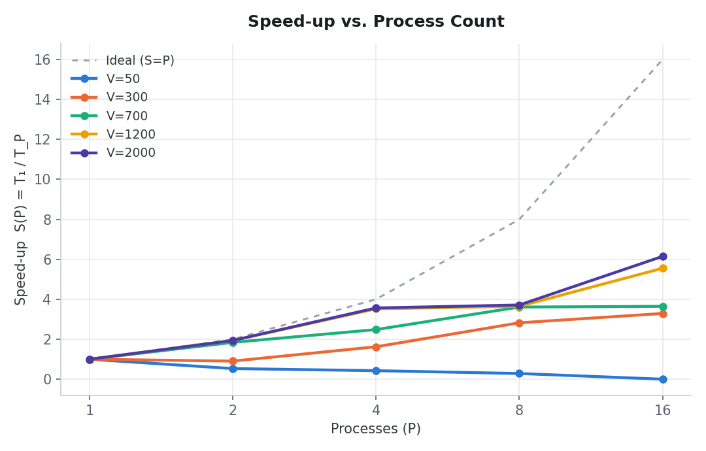
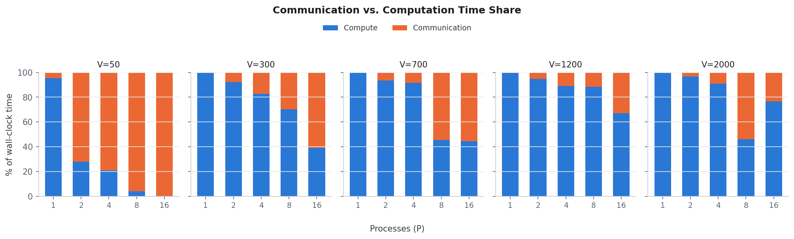

# Q5: All-Pairs Shortest Path (Floyd-Warshall) Report

MPI programming, Project 1, Homework 2. Distributed row-partitioned Floyd-Warshall,
benchmarked on the IIIT RCE cluster (`rce.iiit.ac.in`, Slurm `debug` partition,
`node06`, 16 MPI ranks on one node, `openmpi/4.1.5`, `mpic++ -O3`).

Raw data: [`cluster_results/results.csv`](cluster_results/results.csv). Job log:
[`cluster_results/job_79941.log`](cluster_results/job_79941.log) (Slurm job `79941`).
Implementation and build/run instructions: [`README.md`](README.md).

---

## Results table

Speed-up `S(P) = T₁ / T_P`, where `T₁` is the distributed program's own P=1 run
(isolates parallelization gain from MPI's fixed overhead vs. the plain sequential
binary).

| Input size | P=1 | P=2 | P=4 | P=8 | P=16 |
|---|:---:|:---:|:---:|:---:|:---:|
| V=50 (small)        | 1.00 | 0.53 | 0.43 | 0.29 | 0.00 |
| V=300 (small–medium)| 1.00 | 0.91 | 1.62 | 2.82 | 3.29 |
| V=700 (medium)      | 1.00 | 1.84 | 2.48 | 3.61 | 3.65 |
| V=1200 (large)      | 1.00 | 1.94 | 3.52 | 3.65 | 5.55 |
| V=2000 (very large) | 1.00 | 1.94 | 3.57 | 3.72 | 6.15 |

---

## Runtime table (raw seconds)

| V | P | Sequential (s) | Distributed (s) | Compute (s) | Comm (s) |
|---|---|---:|---:|---:|---:|
| 50   | 1  | 0.000111 | 0.000105 | 0.000101 | 0.0000047 |
| 50   | 2  | 0.000111 | 0.000198 | 0.000055 | 0.000143 |
| 50   | 4  | 0.000111 | 0.000247 | 0.000051 | 0.000195 |
| 50   | 8  | 0.000111 | 0.000368 | 0.000015 | 0.000353 |
| 50   | 16 | 0.000111 | 0.067891 | 0.000013 | 0.067877 |
| 300  | 1  | 0.020958 | 0.017255 | 0.017222 | 0.0000324 |
| 300  | 2  | 0.020958 | 0.019017 | 0.017529 | 0.001488 |
| 300  | 4  | 0.020958 | 0.010625 | 0.008790 | 0.001835 |
| 300  | 8  | 0.020958 | 0.006112 | 0.004287 | 0.001824 |
| 300  | 16 | 0.020958 | 0.005245 | 0.002051 | 0.003194 |
| 700  | 1  | 0.262110 | 0.241710 | 0.241379 | 0.000330 |
| 700  | 2  | 0.262110 | 0.131157 | 0.122623 | 0.008534 |
| 700  | 4  | 0.262110 | 0.097300 | 0.089123 | 0.008177 |
| 700  | 8  | 0.262110 | 0.066943 | 0.030370 | 0.036573 |
| 700  | 16 | 0.262110 | 0.066259 | 0.029531 | 0.036728 |
| 1200 | 1  | 1.300610 | 1.230080 | 1.229070 | 0.001014 |
| 1200 | 2  | 1.300610 | 0.634872 | 0.600699 | 0.034173 |
| 1200 | 4  | 1.300610 | 0.349195 | 0.311296 | 0.037899 |
| 1200 | 8  | 1.300610 | 0.336876 | 0.297304 | 0.039573 |
| 1200 | 16 | 1.300610 | 0.221528 | 0.148761 | 0.072767 |
| 2000 | 1  | 7.442710 | 5.181000 | 5.177350 | 0.003652 |
| 2000 | 2  | 7.442710 | 2.673740 | 2.583290 | 0.090453 |
| 2000 | 4  | 7.442710 | 1.452880 | 1.319980 | 0.132897 |
| 2000 | 8  | 7.442710 | 1.394480 | 0.642377 | 0.752101 |
| 2000 | 16 | 7.442710 | 0.842770 | 0.645975 | 0.196795 |

---

## Efficiency

`E(P) = S(P) / P`.

| V    | E(1)  | E(2)  | E(4)  | E(8)  | E(16) |
|---|---:|---:|---:|---:|---:|
| 50   | 1.000 | 0.266 | 0.107 | 0.036 | 0.000 |
| 300  | 1.000 | 0.454 | 0.406 | 0.353 | 0.206 |
| 700  | 1.000 | 0.921 | 0.621 | 0.451 | 0.228 |
| 1200 | 1.000 | 0.969 | 0.881 | 0.456 | 0.347 |
| 2000 | 1.000 | 0.969 | 0.892 | 0.464 | 0.384 |

Efficiency falls monotonically with `P` at every size. This is expected, since
the per-iteration broadcast cost grows with `P` while each rank's compute share
shrinks as `N³/P`. Larger graphs hold efficiency noticeably better at high `P`
(V=2000 still retains 38% at P=16, vs. 0% for V=50).

---

## Speed-up vs. P

Dashed line is ideal linear speed-up (`S(P) = P`). Every curve sits under it, as
expected for any real parallel program with communication overhead. V=50 curves
*below 1* for every P>1: it gets slower under MPI, not faster. V≥700 tracks
close to ideal through P=4, then peels away as broadcast overhead starts to
dominate.

---

## Communication vs. computation time

Percentage of total distributed wall-clock time spent inside MPI calls
(`Scatterv` + the per-iteration `Bcast` + `Gatherv`) vs. inside the relaxation
loop itself.

- **V=50**: communication share rockets from 4% (P=1) to 96%+ by P=8. The
  entire workload is ~125,000 floating-point comparisons total, too small to
  amortize even one broadcast's latency across many ranks. The P=16 data point
  (67.9 ms, 99.98% comm) is a clear outlier against the sub-millisecond runs
  around it, almost certainly a transient scheduling blip on the shared node
  rather than a real effect, since a P=8 run of the same graph completed in
  0.37 ms.
- **V≥700**: comm share stays under 10% through P=4, then jumps once P
  approaches or exceeds the point where per-rank compute drops below what a
  single broadcast round costs. V=2000 at P=8 (54% comm) is the sharpest jump
  in the whole dataset; interestingly P=16 recovers to 23% for the same size,
  which we read as scheduling noise on a shared machine rather than a real
  non-monotonic trend, since communication cost should not fall as P doubles.

---

## Correctness

The sequential `O(N³)` implementation (`main_seq.cpp`) is the oracle. Every
distributed run is diffed against it after whitespace normalization.

| Case | V | P | What it exercises | Result |
|---|---|---|---|---|
| Assignment sample | 3 | 3 | Hand-verifiable, exact output given in the spec | MATCH |
| Single process | 3 | 1 | Distributed code reduces to the sequential result | MATCH |
| Even split | 300 | 4 | N divisible by P | MATCH |
| Uneven split | 700 | 8 | N not divisible by P (remainder rows) | MATCH |
| More processes than vertices | 3 | 5 | Zero-row processes; zero-count `Scatterv`/`Gatherv` | MATCH |
| Negative-weight edges | 50 | 6 | Potential-reweighted graph, no negative cycle | MATCH |
| Full cluster benchmark matrix | 50, 300, 700, 1200, 2000 | 1, 2, 4, 8, 16 | 25 combinations, generated graphs | 25/25 MATCH |

All 25 combinations in the benchmark matrix passed, plus the 6 targeted edge
cases above.

---

## Implementation notes

- **Compile flags**: `mpic++ -O3 main_dist.cpp` and `g++ -O3 main_seq.cpp`.
  `-O3` is what makes these timings meaningful; a debug build would inflate
  the compute term and understate communication's relative share.
- **Partition**: row-wise, computed once up front: `rows[i] = N/P`, with the
  first `N mod P` processes getting one extra row. Displacements are prefix
  sums of the row counts, so `MPI_Scatterv`/`MPI_Gatherv` hand out contiguous,
  unequal-sized row blocks in a single call each.
- **Non-divisible sizes**: handled by construction rather than as a special
  case. The remainder-distribution above means `N mod P ≠ 0` takes the
  identical code path as an even split (see V=700 at P=8 above: 700/8 = 87
  remainder 4, still correct).
- **P > N**: also handled without a branch. Processes past index `N` get a
  row count of 0, and zero-count `Scatterv`/`Gatherv` is valid MPI. The
  row-owner lookup during the broadcast loop skips these processes
  automatically.
- **Row-owner lookup**: each process independently computes who owns row `k`
  via a linear scan over the (small, size-`P`) displacement table:
  `O(P)` per iteration, `O(N·P)` total, negligible next to the
  `O(N³/P)` compute term.
- **Timing**: both binaries print machine-readable lines to `stderr`
  (`TIME_SECONDS`, and for the distributed version `COMPUTE_SECONDS` /
  `COMM_SECONDS`), keeping `stdout` clean for correctness diffing. The
  distributed timer starts after an `MPI_Barrier` so all ranks begin
  together, and reports the slowest rank's time via `MPI_MAXLOC`, the actual
  wall-clock bottleneck, not an average that could hide stragglers.
- **Cluster execution**: run via a single `sbatch` job
  (`cluster_benchmark.slurm`, 1 node, 16 tasks, 20 min walltime) rather than
  directly on the login node or as many small jobs, to stay considerate of
  the shared, multi-user cluster (`rce.iiit.ac.in` was running several other
  students'/researchers' jobs at submission time).

---

## Conclusion

- **Correctness holds unconditionally.** Every size/process-count combination,
  including deliberately awkward cases (P>N, non-divisible splits, negative
  edge weights), produced output identical to the sequential baseline.
- **Speed-up is real but sub-linear, and only kicks in once N is large
  enough.** V≥700 shows consistent gains through P=16 (up to 6.15× at
  V=2000); V=300 crosses over to net-positive speed-up only around P=4; V=50
  never recovers, every P>1 run is *slower* than sequential, because the
  O(N³) compute term (125,000 operations total) is too small to amortize even
  one broadcast's fixed latency.
- **Efficiency degrades smoothly with P at every size**, confirming the
  broadcast-per-iteration communication pattern is the limiting factor as
  rank count grows. This is exactly what the comm-vs-compute breakdown shows
  directly: comm share climbs with P at every size, fastest for the smallest
  graphs.
- **Practical takeaway**: this row-partitioned approach scales well for
  graphs from a few hundred vertices upward, with diminishing but still
  positive returns out to at least P=16 for V≥1200. For small graphs
  (V≲100), running sequential is strictly faster than paying MPI's broadcast
  overhead.
