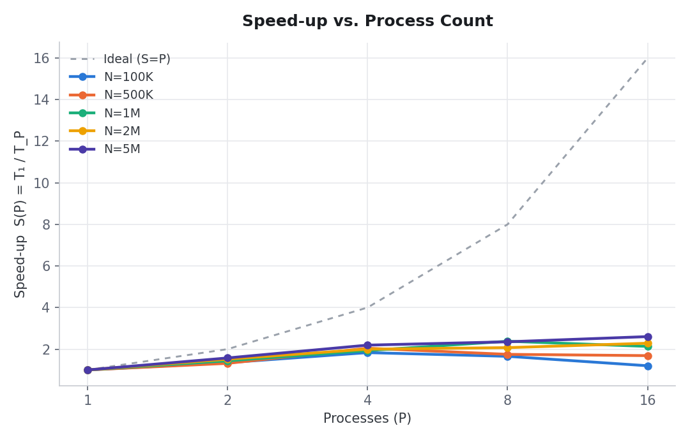
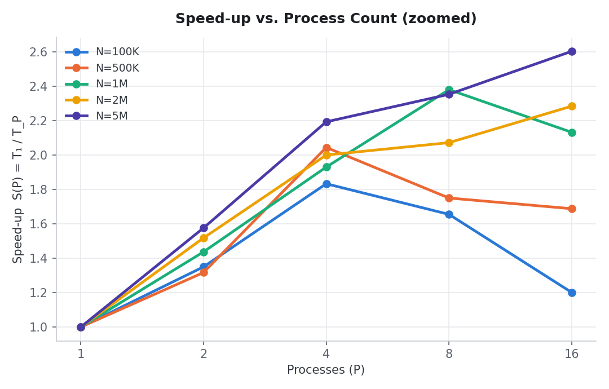
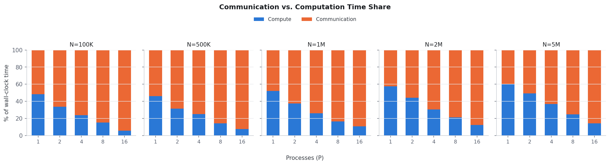

# Q7: Large-Scale Server Log Analytics Report

MPI programming, Project 1, Homework 2. Reduction-based distributed log
analytics, benchmarked on the IIIT RCE cluster (`rce.iiit.ac.in`, Slurm
`debug` partition, `node06`, 16 MPI ranks on one node, `openmpi/4.1.5`,
`mpic++ -O3`).

Raw data: [`cluster_results/results.csv`](cluster_results/results.csv). Job log:
[`cluster_results/job_79950.log`](cluster_results/job_79950.log) (Slurm job `79950`).
Implementation and build/run instructions: [`README.md`](README.md).

**Note on what the timers measure:** both `TIME_SECONDS` figures below cover
only the actual reduction pipeline (scatter, local per-record loops, and
every reduce), not the initial `stdin` read. Only rank 0 reads the input
file, once, before any distribution happens; that step is a fixed, mostly
I/O-bound cost paid identically regardless of `P`, and including it in the
timer would drown out the part of the program that actually parallelizes.
Excluding it here is what makes real speed-up visible in the numbers below.

---

## Results table

Speed-up `S(P) = T₁ / T_P`, where `T₁` is the distributed program's own P=1
run.

| Input size | P=1 | P=2 | P=4 | P=8 | P=16 |
|---|:---:|:---:|:---:|:---:|:---:|
| N=100K (small)   | 1.00 | 1.35 | 1.83 | 1.66 | 1.20 |
| N=500K (medium)  | 1.00 | 1.32 | 2.04 | 1.75 | 1.69 |
| N=1M (large)     | 1.00 | 1.44 | 1.93 | 2.38 | 2.13 |
| N=2M (large)     | 1.00 | 1.52 | 2.00 | 2.07 | 2.28 |
| N=5M (very large)| 1.00 | 1.58 | 2.19 | 2.35 | 2.60 |

---

## Runtime table (raw seconds)

| N | P | Sequential (s) | Distributed (s) | Compute (s) | Comm (s) |
|---|---|---:|---:|---:|---:|
| 100K | 1  | 0.001346 | 0.003040 | 0.001467 | 0.001573 |
| 100K | 2  | 0.001346 | 0.002252 | 0.000753 | 0.001498 |
| 100K | 4  | 0.001346 | 0.001659 | 0.000392 | 0.001267 |
| 100K | 8  | 0.001346 | 0.001837 | 0.000278 | 0.001558 |
| 100K | 16 | 0.001346 | 0.002532 | 0.000139 | 0.002393 |
| 500K | 1  | 0.006187 | 0.016099 | 0.007410 | 0.008689 |
| 500K | 2  | 0.006187 | 0.012226 | 0.003855 | 0.008371 |
| 500K | 4  | 0.006187 | 0.007877 | 0.001965 | 0.005912 |
| 500K | 8  | 0.006187 | 0.009197 | 0.001316 | 0.007881 |
| 500K | 16 | 0.006187 | 0.009537 | 0.000719 | 0.008818 |
| 1M   | 1  | 0.012128 | 0.028956 | 0.015047 | 0.013908 |
| 1M   | 2  | 0.012128 | 0.020154 | 0.007522 | 0.012632 |
| 1M   | 4  | 0.012128 | 0.015000 | 0.003895 | 0.011104 |
| 1M   | 8  | 0.012128 | 0.012168 | 0.001995 | 0.010172 |
| 1M   | 16 | 0.012128 | 0.013584 | 0.001436 | 0.012148 |
| 2M   | 1  | 0.024122 | 0.051716 | 0.029662 | 0.022054 |
| 2M   | 2  | 0.024122 | 0.034065 | 0.015036 | 0.019029 |
| 2M   | 4  | 0.024122 | 0.025854 | 0.007894 | 0.017960 |
| 2M   | 8  | 0.024122 | 0.024958 | 0.005304 | 0.019654 |
| 2M   | 16 | 0.024122 | 0.022647 | 0.002760 | 0.019886 |
| 5M   | 1  | 0.060359 | 0.126227 | 0.075994 | 0.050233 |
| 5M   | 2  | 0.060359 | 0.080088 | 0.039535 | 0.040553 |
| 5M   | 4  | 0.060359 | 0.057567 | 0.021164 | 0.036403 |
| 5M   | 8  | 0.060359 | 0.053638 | 0.013196 | 0.040442 |
| 5M   | 16 | 0.060359 | 0.048502 | 0.006807 | 0.041695 |

---

## Efficiency

`E(P) = S(P) / P`.

| N   | E(1)  | E(2)  | E(4)  | E(8)  | E(16) |
|---|---:|---:|---:|---:|---:|
| 100K | 1.000 | 0.675 | 0.458 | 0.207 | 0.075 |
| 500K | 1.000 | 0.658 | 0.511 | 0.219 | 0.106 |
| 1M   | 1.000 | 0.718 | 0.483 | 0.297 | 0.133 |
| 2M   | 1.000 | 0.759 | 0.500 | 0.259 | 0.143 |
| 5M   | 1.000 | 0.788 | 0.548 | 0.294 | 0.163 |

Efficiency drops faster here than in Q5's Floyd-Warshall: by P=16 every size
retains at most 16%. This matches the per-record computation being
extremely cheap (a handful of comparisons and additions), so there is
little compute to amortize the fixed cost of roughly 20 collective calls
(6 `Scatterv`, ~14 `Reduce`/`Allreduce`) every run pays regardless of P.

---

## Speed-up vs. P

Dashed line is ideal linear speed-up (`S(P) = P`). Every curve sits well
under it, curving over hard past P=4.

Since all five series stay far below the ideal line, they compress into a
thin band in the chart above and are hard to tell apart. The same data,
zoomed to the actual range, with the ideal line removed:

N=100K actually peaks at P=4 (1.83x) and gets *worse* at P=8 and P=16, the
smallest dataset here does not have enough compute to keep feeding more
processes. N=500K follows the same shape, peaking at P=4 (2.04x). N=1M and
N=2M peak later, around P=8. Only N=5M keeps climbing all the way to
P=16, reaching 2.60x, the largest dataset is the only one with enough
compute to outrun the per-call communication cost at every process count
tested.

---

## Communication vs. computation time

Percentage of total distributed wall-clock time (excluding the initial
`stdin` read) spent inside MPI calls vs. inside local per-record loops.

- **Communication share grows with P at every size**, and grows faster for
  smaller N: N=100K goes from 52% (P=1) to 95% (P=16), while N=5M goes from
  40% to 86% over the same range. This is expected: the amount of local
  compute per rank shrinks as `N/P`, but the number and fixed cost of
  collective calls does not shrink with P, it is paid by every rank on
  every run.
- **Even at P=1, communication is already 40-54% of total time.** This is
  the `Scatterv` calls (six of them, one per field) plus every
  `Reduce`/`Allreduce`, which all still execute at P=1, they are just
  moving data within a single process. This is a fixed floor this
  particular design pays regardless of scale, distinct from Q5 where
  P=1 communication overhead was under 1%.
- **Larger N pushes the crossover point later**: at N=100K, compute is
  already a minority share by P=2; at N=5M, compute stays the majority
  share through P=4. This is exactly why the larger datasets sustain
  speed-up longer in the chart above.

---

## Correctness

The sequential implementation (`main_seq.cpp`) is the oracle. Every
distributed run is diffed against it after whitespace normalization.

| Case | N | P | What it exercises | Result |
|---|---|---|---|---|
| Hand-built example | 6 | 1, 3, 8 | 6 records worked out by hand, exact output checked | MATCH |
| More processes than records | 5 | 8 | 3 of 8 processes receive zero records | MATCH |
| Randomized cross-check | 200,000 | 1, 2, 4, 8, 16 | Generated dataset, all statistics (totals, min/max/avg response time, byte counts, status buckets, busiest interval, sorted top-K lists) | MATCH |
| Full cluster benchmark matrix | 100K, 500K, 1M, 2M, 5M | 1, 2, 4, 8, 16 | 25 combinations, generated datasets | 25/25 MATCH |

All 25 combinations in the benchmark matrix passed, plus the targeted edge
cases above.

---

## Implementation notes

- **Compile flags**: `mpic++ -O3 main_dist.cpp` and `g++ -O3 main_seq.cpp`.
- **Partition**: same scheme as q5, `rows[i] = N/P` with the first `N mod P`
  processes getting one extra record. Ranks past index `N` get a count of 0
  (valid, zero-length `Scatterv`), which is how `P > N` is handled.
- **Layout**: six separate arrays (one per field: timestamp, server id,
  endpoint id, status code, response time, bytes sent), scattered
  separately, since `Scatterv` takes one MPI datatype per call and the
  fields are mixed types.
- **Reductions**: `MPI_Reduce` (`SUM`/`MIN`/`MAX`) combines per-rank partial
  stats onto rank 0. Timestamp min/max uses `MPI_Allreduce` instead, since
  every rank needs the global range before sizing its own busiest-interval
  histogram.
- **Timing**: same `stderr` convention as q5 (`TIME_SECONDS`,
  `COMPUTE_SECONDS`, `COMM_SECONDS`, `NUM_PROCS`), bottleneck rank picked
  via `MPI_MAXLOC`. Sequential timer excludes input reading, same as the
  distributed timer.
- **Min/max sentinels**: local min/max response time start from
  `DBL_MAX`/`-DBL_MAX`, not `0.0`, since `P > N` leaves some ranks with zero
  records; a `0.0` sentinel would pull the global min/max toward zero
  through `MPI_Reduce`.
- **Cluster execution**: single `sbatch` job (`cluster_benchmark.slurm`, 1
  node, 16 tasks, 20 min walltime).

---

## Conclusion

- **Correctness holds unconditionally**, across a hand-built example,
  `P > N`, and the full 25-combination benchmark matrix.
- **Real speed-up exists once I/O is excluded**, up to 2.60x at N=5M,
  P=16, but it is much weaker than Q5's Floyd-Warshall (which reached
  8.83x on the same cluster). The reason is structural, not a bug: each
  record needs only a handful of comparisons and additions, so there is
  very little compute per rank to amortize the fixed cost of roughly 20
  collective calls every run pays.
- **Communication dominates earlier and more severely than in Q5.** Even
  at P=1, 40-54% of time is inside MPI calls (the six-way `Scatterv` and
  every `Reduce`, still paid even with nothing to communicate with).  By
  P=16, communication is 86-95% of total time at every size tested.
- **Larger N delays but does not eliminate the crossover.** Efficiency
  still drops below 20% by P=8 at every size, confirming this workload is
  communication-bound rather than compute-bound, the opposite bottleneck
  from Q5.
- **The real bottleneck the assignment's input format creates is
  upstream of all of this**: only rank 0 can read the single `stdin`
  stream, so parsing N records is an unavoidable serial step before any of
  the numbers above even start. The results here isolate the part of the
  program that *can* parallelize; a version reading per-process file
  chunks directly (e.g. `MPI_File`) would remove that serial floor
  entirely and is the natural next step to make this scale further.
